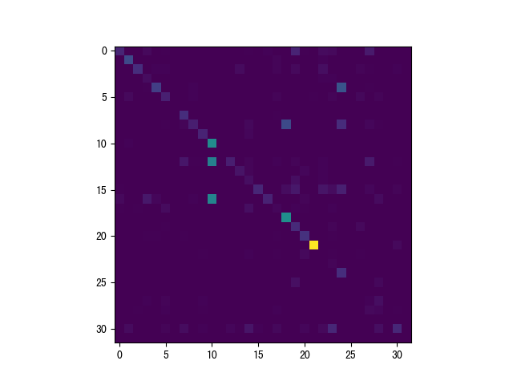
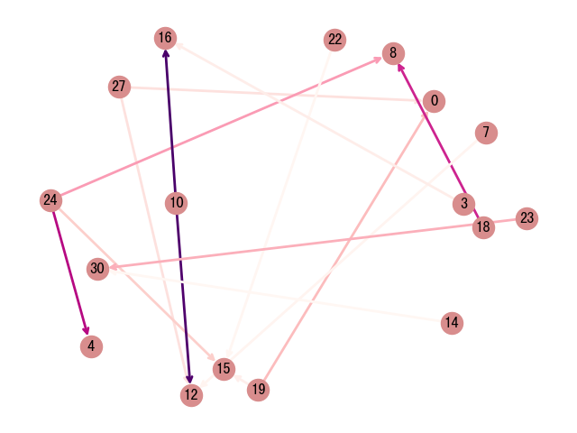

# Hawkes process
Context-sensitive multivariate Hawkes process in JuliaLang v1.2.0

### data

- multiple samples
- multiple types of event
- context (temporary state)

### decay kernel

- exponential kernel

### loss function

- negative log-likelihood

### optimization

- ADMM

### simulation

- Ogata's thinning algorithm 

### regularization

- low-rank
  - nuclear norm (TODO)
- sparsity
  - l1 norm (TODO)

### demo

- Alpha matrix

- Network

